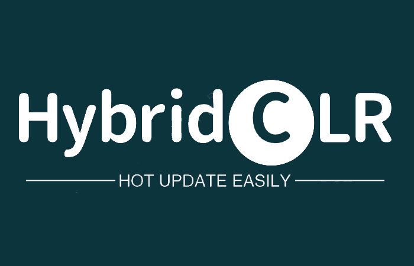

#HybridCLR

 
 

HybridCLR (code-named wolong) is a **near-perfect** Unity full-platform native c# hot update solution with complete features, zero cost, high performance, and low memory.

HybridCLR expands the code of il2cpp, making it change from a pure [AOT](https://en.wikipedia.org/wiki/Ahead-of-time_compilation) runtime to a 'AOT+Interpreter' hybrid runtime, which supports dynamic loading of assemblies natively , so that games packaged based on il2cpp backend can be efficiently executed in **AOT+interpreter** mixed mode not only on Android platform, but also on IOS, Consoles and other platforms that restrict JIT. Hot updates are fully supported from the bottom up.

## Documentation

- [Official Documentation](https://focus-creative-games.github.io/hybridclr/index/)
- [Quick Start](https://focus-creative-games.github.io/hybridclr/start_up/)
- [Sample Project](https://github.com/focus-creative-games/hybridclr_trial)
- [Know the column] (https://www.zhihu.com/column/c_1489549396035870720)
- [UWA Academy](https://edu.uwa4d.com/course-intro/0/432)

## Features

- Features complete. Nearly complete implementation of the [ECMA-335 specification](https://www.ecma-international.org/publications-and-standards/standards/ecma-335/), except for the features below "Limitations and Notes" are supported.
- Zero learning and usage costs. HybridCLR enhances the pure AOT runtime into a full runtime, making hot update code work seamlessly with AOT code. Script classes and AOT classes can write code such as inheritance, reflection, multi-threading (volatile, ThreadStatic, Task, async) at will in the same runtime. There is no need to write any special code, no code generation, and no special restrictions.
- Execute efficiently. Implemented an extremely efficient register interpreter that outperformed other hot update schemes by a large margin by all metrics. [Performance test report](https://focus-creative-games.github.io/hybridclr/benchmark/#performance test report)
- Memory efficient. The classes defined in the hot update script occupy the same memory space as ordinary C# classes, which is far superior to other hot update solutions. [Memory usage report](https://focus-creative-games.github.io/hybridclr/benchmark/#Memory usage report)
- Native support for hotfix to repair part of AOT code. Adds almost no development and runtime overhead.

## working principle

HybridCLR is inspired by mono's [hybrid mode execution](https://developpaper.com/new-net-interpreter-mono-has-arrived/) technology and provides additional interpreter modules for AOT runtimes such as unity's il2cpp , transform them from pure AOT runtime to "AOT + Interpreter" hybrid runtime.

More specifically, HybridCLR does the following:

- Implemented an efficient metadata (dll) parsing library
- Modified the metadata management module to realize the dynamic registration of metadata
- Implemented a compiler from an IL instruction set to a custom register instruction set
- Implemented an efficient register interpreter
- Provide a large number of instinct functions additionally to improve the performance of the interpreter
- Provide hotfix AOT support

## Differences from other popular c# hot update schemes

### Essential comparison

HybridCLR is a native c# hot update solution. In layman's terms, il2cpp is equivalent to the aot module of mono, and HybridCLR is equivalent to the interpreter module of mono. The two are combined into a complete mono. HybridCLR makes il2cpp a full-featured runtime that natively (ie, through System.Reflection.Assembly.Load) supports dynamic loading of dlls, thereby supporting hot updates of the ios platform.

Because HybridCLR is implemented at the native runtime level, the type of the hot update part is completely equivalent and seamlessly unified with the type of the AOT part of the main project. You can call, inherit, reflect, and multithread at will, without generating code or writing adapters.

Other hot update schemes are independent vms, and the relationship with il2cpp is essentially equivalent to the relationship of embedding lua in mono. Therefore, the type system is not unified. In order to allow the hot update type to inherit some types of AOT, an adapter needs to be written, and the type in the interpreter cannot be recognized by the type system of the main project. Incomplete features, troublesome development, and inefficient operation.

### Actual use experience or feature comparison

- The cost of learning and use is almost zero. HybridCLR turns il2cpp into a full-featured runtime with almost zero learning and usage costs and almost zero intrusion. Other schemes have a lot of pits and rules that need to be avoided, learning and use costs, and need to make a lot of modifications to the original project.
- Can use all c# features. Other schemes tend to have a lot of restrictions.
- Can directly support the use and inheritance of types in the main project. Other solutions are to write adapters or generate code.
- Hot update some metadata and AOT metadata are seamlessly unified. Like the reflection code can work properly, the AOT part can also create hot update objects through the standard Reflection interface. Other options can't do it.
- Good support for multithreading. Features like multithreading, ThreadStatic, async, etc. are directly supported by HybridCLR, and other solutions are difficult to support except for the async feature.
- Unity workflow is almost identical to native. The hot update MonoBehaviour in HybridCLR can be directly mounted on the hot update resource and work correctly. Other options do not work.
- Very high compatibility. Various third-party libraries can work under HybridCLR as long as they work under il2cpp. Other solutions often require a lot of magic to modify the source code.
- Extremely memory efficient. The hot update type in HybridCLR is completely equivalent to the AOT type of the main project, occupying the same amount of space. The equivalent types of other schemes are false types, which not only cannot be recognized by the runtime, but also occupy several times more space.
- High execution efficiency. The interaction between the hot update part in HybridCLR and the AOT part of the main project belongs to the internal interaction of il2cpp, which is extremely efficient. The other solution is the efficiency between the independent virtual machine and il2cpp, which is not only troublesome but also inefficient.

## Compatibility

- Support 2019.4.x, 2020.3.x, 2021.3.x series LTS versions
- Supports all il2cpp supported platforms. Currently, the test supports PC (Win32 and Win64), macOS (x86, x64, Arm64), Android (armv7, armv8), iOS (64bit), NS (64bit), WebGL (with a few bugs) platforms, and the remaining platforms are to be tested.
- Tested a large number of common game libraries, and found no libraries that are natively compatible with il2cpp but incompatible with HybridCLR. Any library that works under the il2cpp backend will work fine under HybridCLR. Even those libraries that are incompatible with il2cpp due to AOT issues can now run normally because of HybridCLR's expanded capabilities for il2cpp.

## Stability status

Currently PC (x86 and x64), macOS (x86, x64, Arm64), Android (arm v7 and v8), iOS (64bit) can be used stably. Dozens of large and medium-sized game projects have been integrated in a relatively complete manner, and some of them are being tested before going online.

In view of the stable performance of more than 2 months on several heavy online (quasi-launch) projects, the official version is expected to be released in **August**.

## Accessed commercial projects

- 2022.6.7 Launch the first Android+iOS double-ended match-3 game
- 2022.8.5 launch the second double-ended heavy RPG card
- On August 8, 2022, the third dual-end heavy RPG tower defense game will be launched
- In 2022.8, there are at least 3 more models: MMORPG (heavy), RPG tower defense (moderate), and match-3 (moderate) online
- Others see some of the collection [full access to commercial projects list](https://focus-creative-games.github.io/hybridclr/ref_project/)

## Support and Contact

- QQ group: 651188171 HybridCLR (wolong) technical exchange group **(official main group)**. You can report bugs, but **do not consult basic usage issues in the group**.
- QQ group: 428404198 HybridCLR (wolong) novice group **(novice group)**. If you encounter any problems in the process of using it, you can consult in the group.
- Email: hybridclr@focus-creative-games.com

## RoadMap

Although HybridCLR is related to il2cpp, most of the core code is independent of il2cpp, and it is easy to transplant (expected one month) to other CLR platforms that do not support AOT+Interpreter. No matter how the version of Unity changes, even if il2cpp is abandoned and .net 6+ is used, HybridCLR will continue to follow up and stably provide cross-platform CLR hot update service until one day when .net officially supports AOT+Interpreter, then HybridCLR will complete its historical mission.

- Support `Hybrid Dll` technology (2022.9)
- Instruction optimization, the number of instructions after compilation is reduced to 1/4-1/2, and the performance of basic instructions and most object model instructions is improved by 100%-300%. (2022.10 -)
- Support incremental GC (2022.10 -)

## About the author

**walon**: Founder of **focus-creative-games**

Graduated from the Department of Physics, Tsinghua University, CMO Gold Medal in 2006, member of the National Math Olympiad Training Team, recommended to Tsinghua Basic Course. Focus on game technology, good at developing architecture and infrastructure.

## Sponsor

We invested a lot of manpower and other resources in the development of HybridCLR, and your sponsorship will help us persevere and make it faster and better. Thank you for your generosity!

**WeChat**

**Alipay**

## license

HybridCLR is licensed under the [MIT](https://github.com/focus-creative-games/hybridclr/blob/main/LICENSE) license